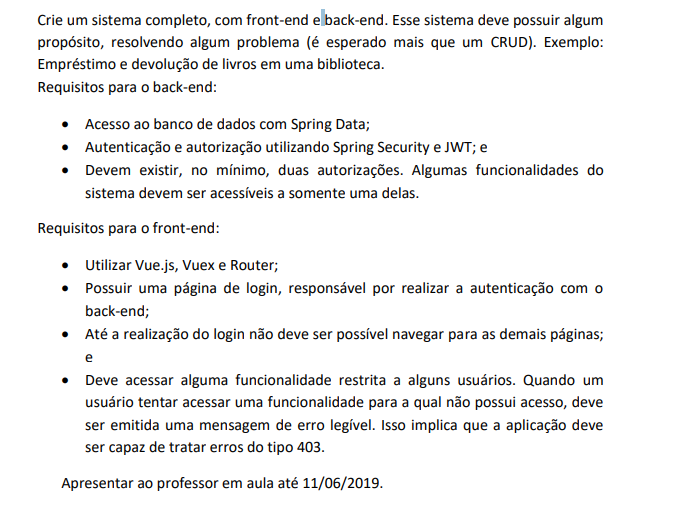

# ProjetoSpringBackEnd

**Objetivo:** O projeto consiste, em criar uma aplicação web completa utilziando frameworks da familia Spring, e para o front-end será utilizado o vue.js, que se trata de uma biblioteca javaScript para criar componentes de tela para front-end. 

## Requisitos funcionais levantados para a criação do sistema.

- O sistema deve conter um login
- Duas autorizações (admin, user)
- Cadastro de Veículos
- Reserva
- Cancela reserva
- Regras de negocio para calcular reserva
- Listar todos os carros disponíveis
- Listar todos os carros reservados
- CRUD de clientes
- CRUD de veiculos
- Listar todos os usuarios
- Listar os carros reservados por pessoa

### Frameworks utilzados neste projeto
Neste projeto, foram utilizados os seguintes frameworks:

#### Backend:
- Spring Boot
- Spring MVC
- Spring data JPA
- spring Security
- Hibernate

#### Front-end:
- Bootstrap
- vue.js
